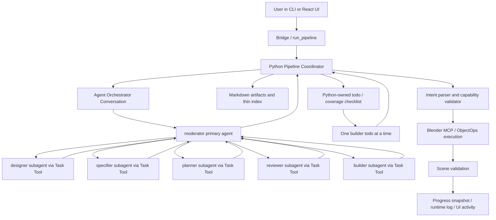

# Current Runtime Flow

This page is the short operational map for the active AO-backed multi-expert
runtime.

## Flow

## Responsibilities

- React UI and CLI collect task input and start a session.
- Python owns phase sequencing, AO provisioning, artifact persistence, todo
  state, MCP execution, scene validation, and progress snapshots.
- AO owns model calls, moderator behavior, and subagent task delegation.
- `moderator` is the only main-session agent used by Python.
- Subagents think in child sessions through the Task Tool; the main session keeps
  only their returned conclusions.
- Markdown artifacts are the human/agent source of truth.
- `artifact_index.json` is thin Python/UI metadata, not an agent-authored
  artifact.
- Builder never controls Blender directly. It writes one operation intent for
  the current todo; Python maps that intent to allowed MCP/ObjectOps calls.

## Active Session Artifacts

The runtime writes these under the session artifact directory:

- `design.md`
- `spec.md`
- `build_plan.md`
- `todo.md`
- `build_log.md`
- `final_report.md`
- `artifact_index.json`

## Failure Boundary

If AO readiness, message delivery, parsing, capability validation, MCP execution,
or scene validation fails, Python records the failure in session runtime state.
The UI should show that state through the existing progress/activity surfaces.
